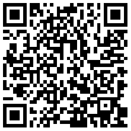

##  此demo主要用来测试正式环境使用

[TOC]

###  1. 运行指南：

Android Studio：下载SDK包（[ZegoSDK 下载地址](https://doc-zh.zego.im/zh/2969.html)），放入项目/app/zego_libs/ 路径下，build and run 

APP：左侧点击扫描按钮，扫描对应配置的二维码，配置二维码地址：[http://doc.oa.zego.im/tool/QrcodeConfig](http://doc.oa.zego.im/tool/QrcodeConfig)，（标题一栏，可输入 隔离域名）

###  2. 注意事项：

如果没有配置CDN，或者单流不转退CDN的，需要勾上复选框，观众优先从UDP拉流。

### 3. 手机打开浏览器，扫描二维码下载APP

###  解释：
此demo并没有对各类资源进行回收销毁的逻辑，只用来做基础推拉流的正式环境测试验证，无需过度关注细节逻辑，基础功能是可支撑的。